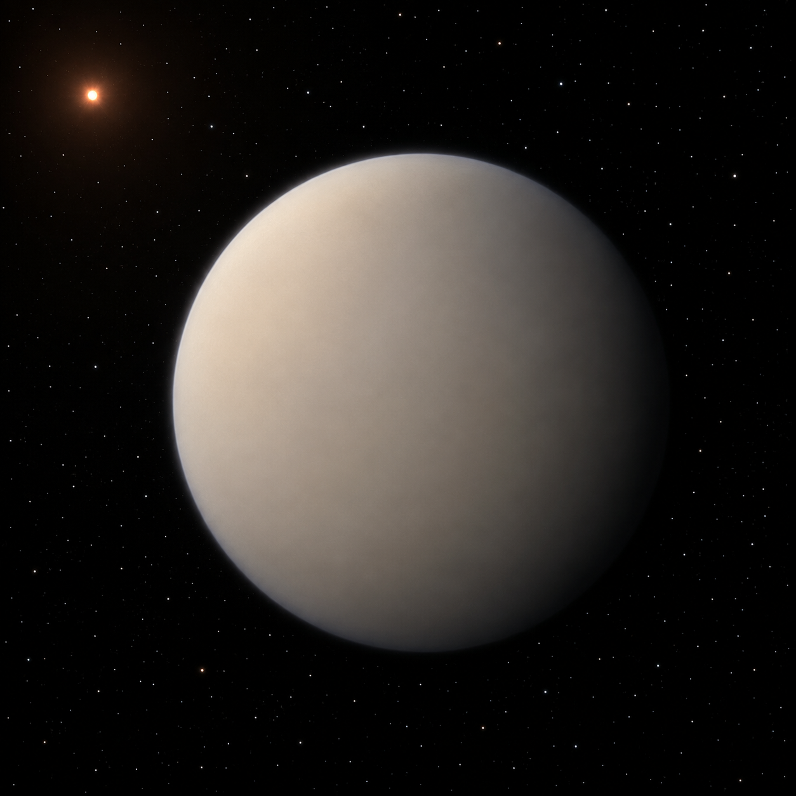

# GJ 1214 b — Exoplanet Atmosphere Report
<!-- RESEARCH-IDENTITY-START -->
**Independent research report by [Biswajit Jana](https://biswajit1999.github.io/Biswajit_Jana.github.io/)** · [Live report](https://biswajit1999.github.io/gj1214b-exoplanet-report/) · [ORCID](https://orcid.org/0009-0002-2411-1891) · [Complete research portfolio](https://biswajit1999.github.io/Biswajit_Jana.github.io/research/exoplanets/)
<!-- RESEARCH-IDENTITY-END -->


<p align="center">
  
</p>

<p align="center"><em>AI-generated artist's concept — not a real photograph. See the report for actual JWST MIRI data.</em></p>

The archetypal "flat spectrum" mini-Neptune, hidden behind clouds or haze
through more than a decade of transmission spectroscopy. This repo uses
JWST MIRI phase-curve data — measuring thermal emission instead of
transmission — to invert per-bin day and night brightness temperatures
with propagated uncertainty, and compares them to Kempton et al. (2023)'s
own published values.

**[Open the full report](https://biswajit1999.github.io/gj1214b-exoplanet-report/)** — the live GitHub Pages version. You can also open `index.html` locally in a browser, or serve it with `python -m http.server` from this directory.

## Data sources

- **System parameters** — from the NASA Exoplanet Archive TAP
  service (`pscomppars` table).
- **MIRI phase-curve spectral results** — the per-wavelength-bin
  best-fit dayside/nightside flux ratios and Rp/Rs, each with asymmetric
  uncertainties, from Kempton et al. (2023), released publicly on Zenodo
  ([10.5281/zenodo.7703086](https://doi.org/10.5281/zenodo.7703086)).
- **Analysis** — `scripts/analyze_spectrum.py` inverts each bin's flux
  ratio into a brightness temperature via the Planck function,
  propagates each bin's own asymmetric error through the inversion, and
  combines bins with an inverse-variance weighted mean rather than a
  plain average. Run it yourself:

  ```bash
  pip install -r requirements.txt
  python scripts/analyze_spectrum.py
  ```

## Repository structure

```text
index.html              the report webpage
data/                    MIRI phase-curve spectral fit results (Zenodo)
scripts/analyze_spectrum.py   Planck-inversion analysis, this script vs. the paper
figures/                 generated plot + summary_statistics.csv
tests/                   unit tests + a regression check against the real data
```

## Tests

`tests/test_analysis.py` checks the Planck-inversion round trip and,
most importantly, directly guards against reintroducing the
flux-clipping bug this repo was fixed for: a non-positive lower flux
bound must be reported as an unconstrained (0 K) temperature bound,
never clipped to a fake small positive flux. It then reruns the full
pipeline on the real downloaded phase curve, verifying it still
reproduces the numbers this README documents — including that exactly
four real nightside bins remain flagged as unconstrained. Runs
automatically on every push via GitHub Actions; run locally with:

```bash
pytest tests/ -v
```

## What the numbers show

14 wavelength bins, 5.1-12.0 microns. This page's weighted-mean brightness
temperature is 575 ± 5 K dayside and 506 ± 9 K nightside — in the same
range as Kempton et al.'s own 553 ± 9 K and 437 ± 19 K, which come from
fitting the full spectrum jointly rather than combining independent
per-bin inversions, so the two shouldn't be read as the same estimator.
Both show a day-night contrast well below an ultra-hot Jupiter like
WASP-121 b's ~1560 K (see that report in this series), broadly consistent
with a real atmosphere redistributing heat imperfectly rather than a bare
rock. Kempton et al. also derive a Bond albedo of 0.51 ± 0.06 from their
full fit — something this repo's simpler per-bin approach doesn't attempt.

## Limitations

Four of the fourteen nightside bins have a fitted flux whose lower
uncertainty bound crosses zero — a real low-signal-to-noise result, not
a data error. For those bins, the lower brightness-temperature bound is
reported as unconstrained (0 K, the physical floor as flux approaches
zero) rather than computed from an arbitrarily small positive flux,
which would have manufactured a falsely precise finite number out of
what is really a non-detection at that confidence level. Those four
bins are marked separately in the figure and get correspondingly little
weight in the combined mean, rather than being folded in silently.
This is a diagonal, per-bin inversion — it does not reproduce the joint
posterior Kempton et al. fit across the whole spectrum, nor their Bond
albedo derivation.

## References

1. Charbonneau, D. et al., 2009. A super-Earth transiting a nearby low-mass
   star. *Nature*, 462, pp.891-894.
2. Kempton, E.M.-R. et al., 2023. A reflective, metal-rich atmosphere for
   GJ 1214b from its JWST phase curve. *Nature*, 620, pp.67-71.
3. Zenodo record
   [10.5281/zenodo.7703086](https://doi.org/10.5281/zenodo.7703086),
   "GJ 1214b MIRI phase curve analysis."
4. Kreidberg, L. et al., 2014. Clouds in the atmosphere of the super-Earth
   exoplanet GJ1214b. *Nature*, 505, pp.69-72.
5. NASA Exoplanet Archive, <https://exoplanetarchive.ipac.caltech.edu/>.

## Author

Biswajit Jana — [Portfolio](https://biswajit1999.github.io/Biswajit_Jana.github.io/) · [GitHub](https://github.com/Biswajit1999) · [LinkedIn](https://www.linkedin.com/in/biswajit-jana-27011a151/) · [ORCID](https://orcid.org/0009-0002-2411-1891)
